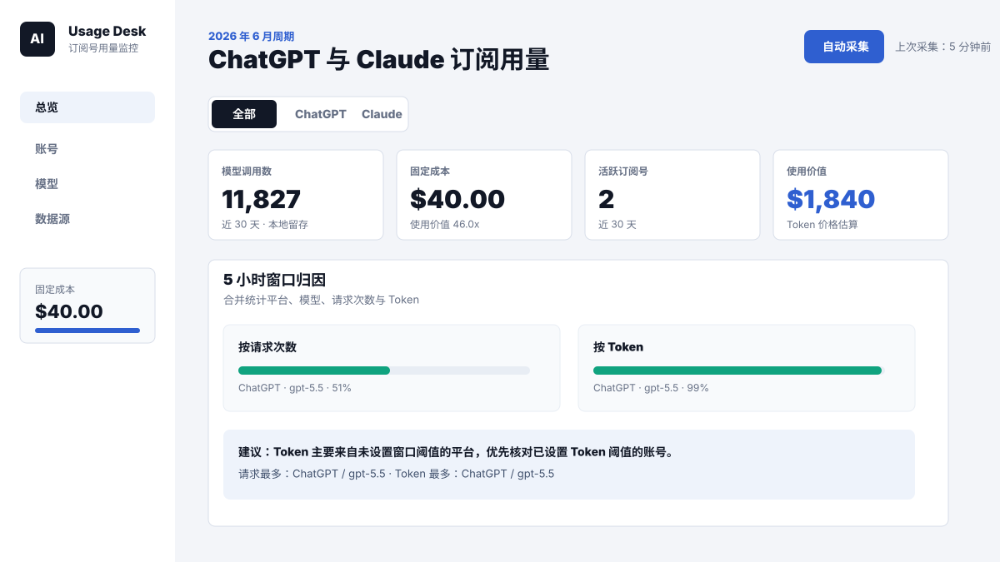

# AI Subscription Usage Dashboard

一个本地优先的 AI 订阅用量仪表盘，用于从本机日志分析 ChatGPT/Codex CLI 与 Claude Code 的订阅使用情况。

它关注的是订阅账号运营：固定月费、Token 估算使用价值、模型级归因、5 小时窗口限额诊断、账号健康度和本地历史留存。项目不调用 OpenAI 或 Anthropic Admin API，也不会把本地用量数据上传到远程服务。



## 核心能力

- 从本机日志自动采集：`~/.claude/projects`、`~/.codex/sessions`、`~/.codex/archived_sessions`。
- 按账号统计请求数、Token、固定成本、估算使用价值。
- 按模型拆分输入、输出、缓存写入、缓存读取、推理 Token、总 Token 和含缓存 Token。
- 5 小时窗口归因：合并统计平台、模型、请求次数与 Token，判断窗口限额主要由谁触发。
- 订阅健康度：实时 5 小时限额、近 7 天周限额、续费风险、数据质量。
- 本地持久化：采集结果保存在 `data/store.json`。
- 统一 USD 展示，不做汇率换算。

## 为什么做这个项目

AI 编程工具的订阅限额往往不是简单的“用了多少钱”问题。用户真正关心的是：

- 哪个账号或平台消耗最多？
- 是请求次数触发限制，还是 Token / 长上下文触发限制？
- 哪个模型在窗口期内贡献了最多 Token？
- 固定订阅成本是否被充分使用？
- 如何在不上传日志的前提下保留历史记录并排查峰值？

这个项目把这些问题放在一个本地 Dashboard 中解决。

## 快速开始

要求 Node.js 18 或更高版本。

```bash
npm start
```

然后打开：

```text
http://localhost:4173
```

点击 `自动采集`，系统会扫描本机 Claude Code 和 Codex CLI 日志。

## 数据来源

当前只读取本地 JSONL 日志：

- Claude Code：`~/.claude/projects/**/*.jsonl`
- Codex CLI：`~/.codex/sessions/**/*.jsonl`
- Codex archived sessions：`~/.codex/archived_sessions/**/*.jsonl`

采集后的仪表盘数据保存在：

```text
data/store.json
```

这个文件默认被 `.gitignore` 排除，因为它可能包含账号名称、本机路径、使用历史、会话时间和模型使用模式。

## 固定成本与使用价值

项目刻意区分两个概念：

- 固定成本：用户配置的订阅账号月费。
- 使用价值：根据 Token 用量和模型价格假设估算出的价值。

使用价值不是实际账单，而是用于判断固定订阅是否被充分使用。

## 5 小时窗口归因

5 小时窗口模块用于回答限额排查问题：

- 当前窗口内哪个平台请求最多？
- 当前窗口内哪个模型 Token 最多？
- 请求次数最多和 Token 最多是否来自同一来源？
- 当前账号是按 Token 阈值、请求额度，还是尚未设置阈值？
- 如果窗口限额触发，应该优先检查哪个平台 / 模型？

这比单纯展示趋势图更接近真实使用场景。

## 隐私设计

- 不需要 API Key。
- 不调用 OpenAI / Anthropic Admin API。
- 不上传本地日志。
- 默认忽略 `data/`、`.env*`、IDE 配置和本地预览截图。
- 只开放 loopback 本地写接口，避免局域网环境误操作。

发布 fork 或分享调试数据前，请阅读 [SECURITY.md](SECURITY.md)。

## 开发

```bash
npm run check
npm start
```

项目刻意保持轻量：Node.js HTTP 服务 + 原生 HTML/CSS/JavaScript 前端。

## GitHub Topics 建议

建议在 GitHub 仓库设置中添加：

```text
codex, claude-code, chatgpt, usage-dashboard, token-usage, local-first, developer-tools, ai-usage
```

## License

MIT
